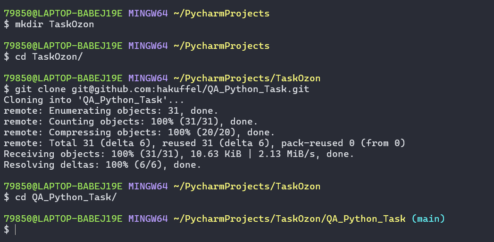
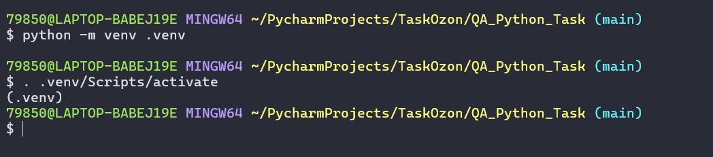
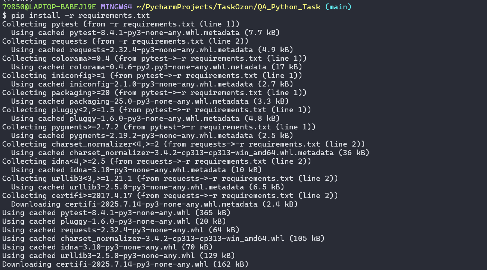
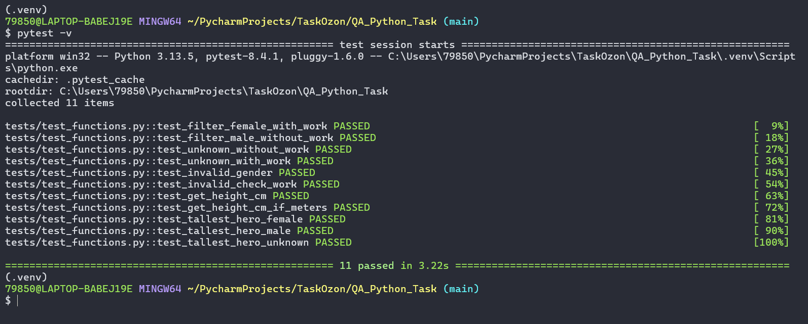
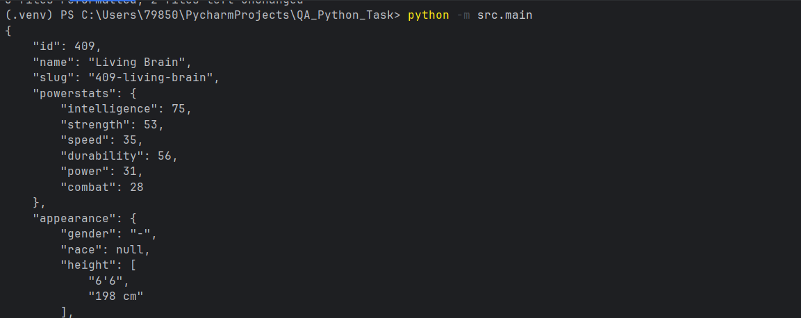

# QA_Python_Task

API: https://akabab.github.io/superhero-api/ с информацией по супергероям. <br>
В данном проекте реализована функция, которая принимает на вход пол и наличие работы(bool) после чего возвращает самого высокого героя.
---

---
## Инструкция по запуску

### Клонирование проекта

Для начала необходимо настроить всё для запуска тестов, а начать надо с клонирования непосредственно проекта. Для таких же визуалов как я буду прикреплять несколько скрины.

- Создать новую директорию командой ```mkdir {название папки}```, куда будет склонирован сам проект
- Перейти туда с помощью ```cd {название созданной папки```
- Склонировать проект ```git@github.com:hakuffel/QA_Python_Task.git```

<br>

---

### Настройка виртуального окружения
Следующим этапом идёт создание виртуального окружения:

 - Создаём виртуальное окружение `python -m venv .venv`
 -  Активируем виртуальное окружение (Ввод для каждой операционной системы индвидуальный):
    - `. .venv/Scripts/activate`/ `.venv\Scripts\activate`/`.\.venv\Scripts\Activate.ps1`
 - После активации в начале строки терминала появится `(.venv)`

<br>

- `pip install -r requirements.txt` для установки зависимостей проекта

<br>

---
## Запуск тестов

 - `pytest -v` для запуска всех тестов
 - `pytest -m positive -v` для запуска тестов с позитивными кейсами, куда подаются валидные данные
 - `pytest -m negative -v` для запуска тестов с негативными кейсами, где введены невалидные данные

<br>

Для запуска мейна `python -m src.main` 

<br>

---

---